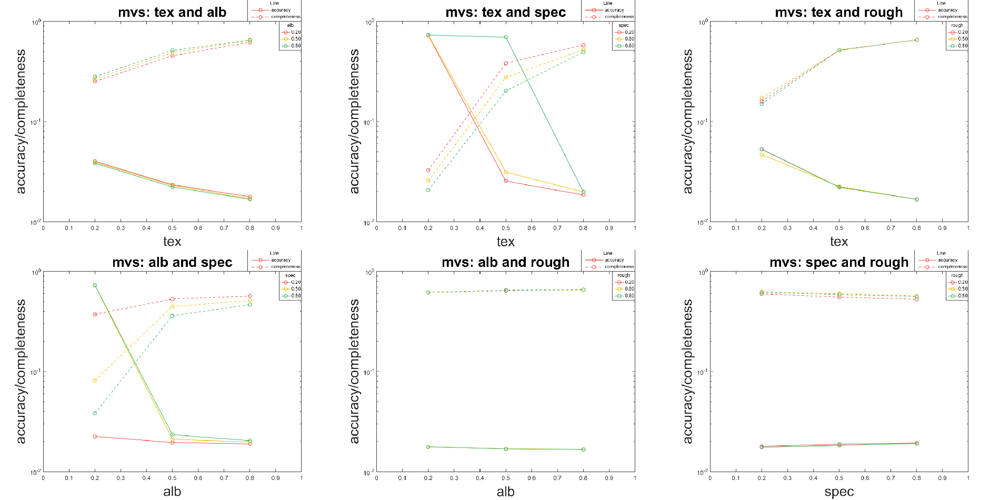

`run.mat`: run the algorithms and evaluate.mat to compute the accuracy and completeness

`eval_acc_cmplt`: evaluate the accuracy and completeness of MVS, SL and VH

`eval_angle`: evaluate the angle difference of PS

`gen_norms.mat`: generate uniformly distributed samples on a sphere

## files that not used
`evaluate.mat`: compute the accuracy and completeness of the reconstruction

`evaluate_mvs.mat` and `evaluate_sl.mat` are currently not used

`eval_ps.mat`: evaluate the PS as a height map

## Results

### Dependency checking

#### MVS

#### PS

#### SL
