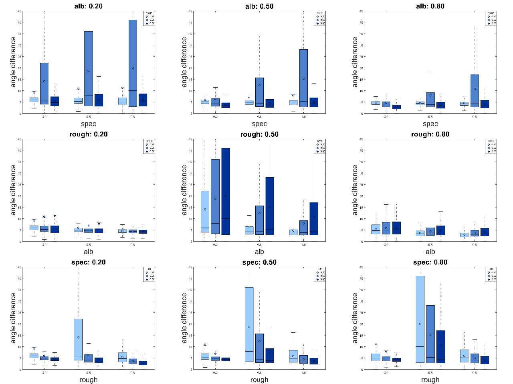
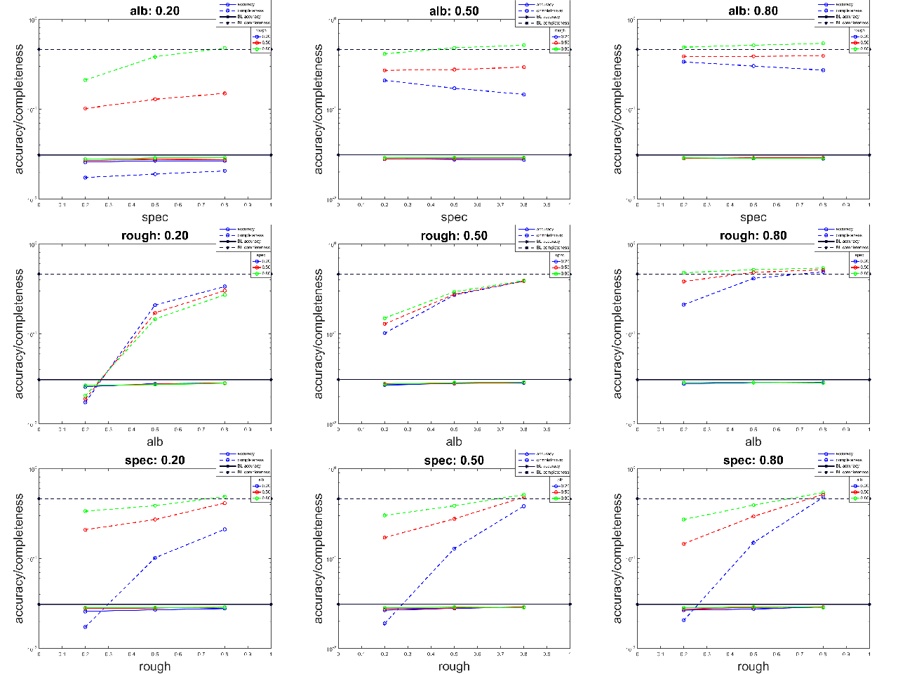

## Algorithms
* PMVS: patch-based Multi-view Stereo
* EPS: example-based Photometric Stereo
* GSL: gray-encoded Structured Light
* VH: volumetric based Visual Hull
* SC: space carving

## Evaluation

There are three separate directories: `pairwise`, `train`, and `test`. Each directory, there are two files:
* `run` (`train`, `test`); run the algorithms to compute the accuracy and completeness
* `analysis`: plot the graphs
* `eval_acc_cmplt`: evaluate the accuracy and completeness of MVS, SL and VH
* `eval_angle`: evaluate the angle difference of PS

## Results

### Dependency checking

#### MVS

#### PS

#### SL

### Training

#### MVS

#### PS

#### SL

## files that not used
`evaluate.mat`: compute the accuracy and completeness of the reconstruction

`evaluate_mvs.mat` and `evaluate_sl.mat` are currently not used

`eval_ps.mat`: evaluate the PS as a height map